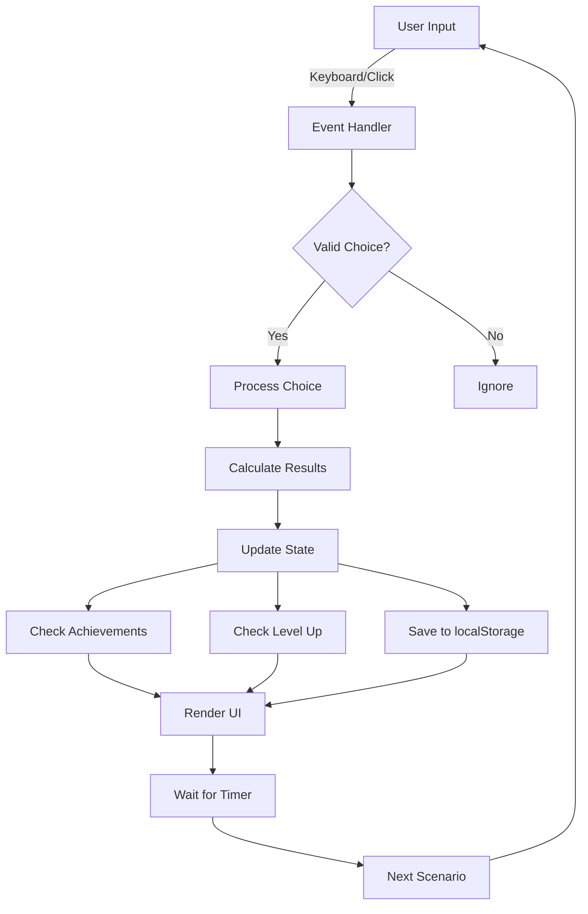

# Architecture Documentation

## Overview

CREATE.I.DESTROY is a client-side, browser-based mystical choice game built with vanilla JavaScript ES6 modules. The architecture prioritizes simplicity, maintainability, and performance while delivering an engaging gameplay experience.

## Technology Stack

- **Frontend**: HTML5, CSS3, Vanilla JavaScript ES6
- **Build System**: TypeScript (for testing package only)
- **Testing**: Vitest
- **Linting**: ESLint with TypeScript support
- **Version Control**: Git/GitHub
- **Deployment**: GitHub Pages (static hosting)

## Project Structure

```
create-i-destroy/
├── index.html              # Main entry point
├── styles.css              # Global styles
├── files/
│   └── js/                 # Game JavaScript modules
│       ├── game.js         # Core game logic and state management
│       ├── scenarios.js    # Game scenarios and choices
│       ├── achievements.js # Achievement system
│       ├── tutorial.js     # Tutorial system
│       ├── ui.js          # UI rendering functions
│       └── utils.js       # Utility functions
├── packages/
│   └── app/               # TypeScript testing package
│       ├── src/           # TypeScript source files
│       │   ├── core.ts    # Core functionality
│       │   ├── types.ts   # Type definitions
│       │   └── index.ts   # Package entry point
│       └── tests/         # Vitest test files
└── .github/
    └── workflows/         # CI/CD workflows
```

## Core Modules

### game.js - Core Game Logic

**Responsibilities:**
- Game state management
- Game loop and scenario progression
- Player choice handling
- Timing and scoring logic
- Save/load functionality
- Settings management
- Sound effects via Web Audio API

**Key Components:**
- `state`: Global game state object
- `gameSettings`: User preferences
- `difficultySettings`: Difficulty configuration
- `playScenario()`: Main game loop
- `loadGame()` / `saveGame()`: Persistence
- `playSoundEffect()`: Audio feedback

**State Management:**
```javascript
state = {
  // Current session
  xp: number,
  survival: number,
  combo: number,
  
  // Persistent stats
  totalXP: number,
  totalSurvival: number,
  characterLevel: number,
  skillPoints: number,
  
  // Progression tracking
  gamesPlayed: number,
  totalChoices: number,
  highestCombo: number,
  
  // Skills
  skills: {
    wisdom, fortune, intuition,
    courage, balance
  }
}
```

### scenarios.js - Game Content

**Responsibilities:**
- Define all game scenarios
- Store choice options and outcomes
- Provide narrative content

**Data Structure:**
```javascript
{
  id: number,
  text: string,           // Scenario description
  choices: [
    {
      key: string,        // Keyboard key (Q/W/E)
      label: string,      // Choice description
      result: {
        feedback: string, // Result message
        xp: number,      // Wisdom gained
        survival: number // Fortune gained
      }
    }
  ]
}
```

### ui.js - User Interface

**Responsibilities:**
- DOM manipulation
- Rendering game state
- Visual feedback
- UI animations

**Key Functions:**
- `renderScenario()`: Display scenario and choices
- `renderProgressBar()`: Show timer
- `renderFeedback()`: Display result messages
- `renderXP()`: Show rewards
- `renderAchievement()`: Achievement notifications

### achievements.js - Achievement System

**Responsibilities:**
- Define achievements
- Check unlock conditions
- Track unlocked achievements
- Persist achievement data

**Achievement Tiers:**
- Bronze 🥉: Entry-level
- Silver 🥈: Intermediate
- Gold 🥇: Advanced
- Legendary 🌟: Expert
- Mythic 👑: Ultimate

### tutorial.js - Tutorial System

**Responsibilities:**
- First-time user onboarding
- Step-by-step guidance
- Tutorial state persistence

**Features:**
- 10-step interactive tutorial
- Skip functionality
- Progress tracking
- Element highlighting

### utils.js - Utility Functions

**Responsibilities:**
- Reusable helper functions
- Mathematical operations
- Array manipulation
- Async utilities

**Key Functions:**
- `randomBetween()`: Random number generation
- `shuffle()`: Fisher-Yates array shuffle
- `clamp()`: Value clamping
- `formatNumber()`: Number formatting
- `wait()`: Promise-based delay

## Data Flow



## Game Loop

1. **Scenario Setup**:
   - Load next scenario from shuffled queue
   - Render scenario text and choices
   - Initialize timer

2. **Player Input Phase**:
   - Listen for keyboard/click input
   - Validate choice
   - Process immediately on valid input

3. **Result Processing**:
   - Calculate adjusted rewards (difficulty + skills)
   - Update XP and survival
   - Check for combos and legendary moments
   - Check for level ups
   - Check for new achievements

4. **Feedback Display**:
   - Show result message
   - Display reward amounts
   - Play sound effects
   - Show achievement notifications

5. **Transition**:
   - Save game state
   - Brief delay for feedback
   - Load next scenario

## Difficulty System

```javascript
difficultySettings = {
  easy: {
    time: 5,              // 5 seconds per choice
    xpMultiplier: 0.8,    // 80% XP
    survivalMultiplier: 1.2  // 120% survival
  },
  normal: {
    time: 3,
    xpMultiplier: 1.0,
    survivalMultiplier: 1.0
  },
  hard: {
    time: 2,
    xpMultiplier: 1.3,
    survivalMultiplier: 0.8
  },
  nightmare: {
    time: 1.5,
    xpMultiplier: 1.5,
    survivalMultiplier: 0.5
  }
}
```

## Skill System

Players earn skill points through leveling up (every 100 total XP). Skills provide passive bonuses:

- **Wisdom**: +10% XP per point
- **Fortune**: +10% survival per point
- **Intuition**: +0.3s decision time per point
- **Courage**: +15% XP for high-risk choices per point
- **Balance**: +10% bonus for moderate choices per point

## Persistence

All data is stored in localStorage:

```javascript
// Keys used
'createiDestroySave'              // Game state
'createiDestroySettings'          // User settings
'createiDestroyAchievements'      // Unlocked achievements
'createiDestroyTutorialComplete'  // Tutorial status
```

**Save Data Structure:**
- Includes full state object
- Timestamp for save time
- Validated on load
- Safe defaults for missing data

## Sound System

Uses Web Audio API for dynamic sound generation:

- No external audio files
- Programmatic tone generation
- Multiple sound types (success, fail, legendary, etc.)
- User-controllable volume
- Can be fully disabled

**Sound Types:**
- `choice`: Button press confirmation
- `success`: Positive outcome
- `fail`: Negative outcome
- `legendary`: Combo achievement
- `tick`: Timer warning
- `levelup`: Character level increase
- `achievement`: Achievement unlock
- `tab`: UI navigation
- `hover`: UI interaction

## Performance Considerations

1. **No Build Step for Game Files**: Pure ES6 modules loaded directly
2. **Minimal DOM Manipulation**: Batch updates where possible
3. **Event Delegation**: Efficient event handling
4. **LocalStorage Throttling**: Save only when needed
5. **Timer Optimization**: Fixed interval (100ms) for smooth animation
6. **Memory Management**: No memory leaks, proper cleanup

## Security Architecture

1. **Input Validation**:
   - All localStorage data validated
   - Type checking on all inputs
   - File size limits on imports

2. **No External Dependencies**:
   - No npm packages in runtime
   - No CDN dependencies
   - Self-contained application

3. **CSP Compatibility**:
   - No inline scripts (CSP-safe)
   - No eval or dynamic code
   - Safe for strict CSP policies

## Testing Strategy

1. **Unit Tests**:
   - Utility functions (utils.js)
   - Core logic (core.ts)
   - Edge cases and error handling

2. **Integration Tests**:
   - Game state transitions
   - Achievement unlocking
   - Save/load functionality

3. **Manual Testing**:
   - Full gameplay sessions
   - UI interactions
   - Browser compatibility

## Browser Compatibility

**Minimum Requirements:**
- ES6 module support
- localStorage API
- Web Audio API
- Modern CSS (Grid, Flexbox)

**Tested Browsers:**
- Chrome/Edge 90+
- Firefox 88+
- Safari 14+

## Deployment

**GitHub Pages Workflow:**
1. Push to `main` branch
2. GitHub Actions workflow triggers
3. Runs tests and build
4. Deploys to gh-pages branch
5. Available at github.io URL

**No Server Required:**
- Fully static site
- Can be served from any web server
- No backend dependencies

## Future Architecture Considerations

Potential enhancements that maintain current architecture:

1. **Progressive Web App (PWA)**:
   - Add service worker for offline support
   - Enable "Add to Home Screen"
   - Cache game assets

2. **Modular Scenarios**:
   - Load scenarios from JSON files
   - Support for user-created content
   - Scenario packs/DLC

3. **Enhanced Analytics**:
   - Local-only gameplay analytics
   - Performance tracking
   - A/B testing frameworks

4. **Internationalization**:
   - Multi-language support
   - Locale-aware formatting
   - RTL layout support

## Maintainability

**Code Standards:**
- JSDoc documentation for all functions
- Named constants for magic numbers
- Consistent naming conventions
- Modular architecture

**Testing Requirements:**
- All new features require tests
- Maintain >80% code coverage
- Manual testing checklist

**Version Control:**
- Semantic versioning
- Detailed commit messages
- Branch protection rules

## License

MIT License - See LICENSE file for details.

Last Updated: 2025-10-18
